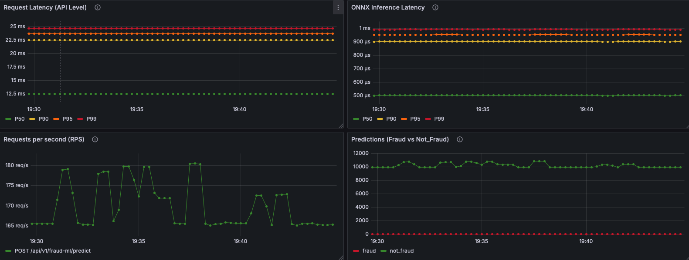
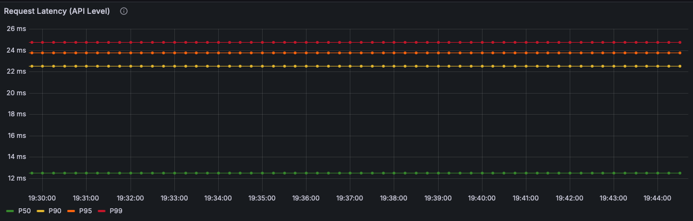
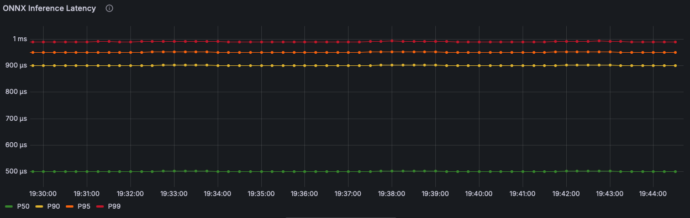
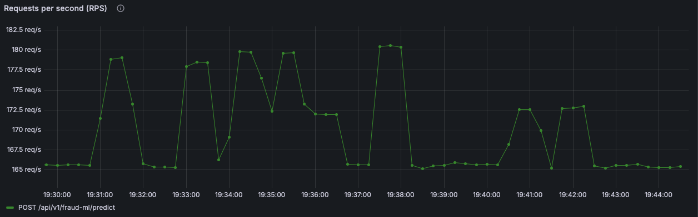
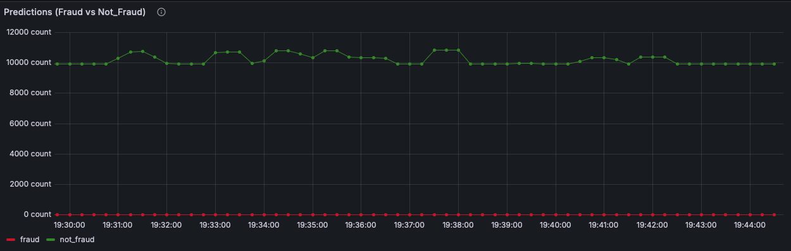

# Fraud ML Service – Observability

**Dashboard:** Fraud ML Service – Prometheus <br>
Service: fraud-ml-service (Python + Flask + ONNX model inference) <br>
Purpose: Measure request latency, ONNX inference duration, request throughput (RPS), and fraud vs. not_fraud prediction distribution.

## Overview



## 1) Request Latency (API Level)
**Panel title:** Request Latency (Histogram Quantiles) <br>
What it shows: End-to-end HTTP request latency for /api/v1/fraud-ml/predict.<br>
Unit: `seconds`

* Legend: P50
* Query
```
histogram_quantile(0.50,
  sum by (le) (
    rate(rpp_fraud_ml_http_request_duration_seconds_bucket{endpoint="/api/v1/fraud-ml/predict", method="POST"}[1m])
  )
)
```

Screenshot: 

## 2) ONNX Inference Latency

**Panel title:** ONNX Inference Latency (Histogram Quantiles) <br>
What it shows: Time taken by the ONNX model to execute inference per request. <br>
Unit: `seconds`

* Legend: P50
* Query
```
histogram_quantile(0.50,
  sum by (le) (
    rate(rpp_fraud_ml_inference_duration_seconds_bucket[$__rate_interval])
  )
)
```
Screenshot: 

## 3) Requests per Second (RPS)

**Panel title:** Requests per Second (RPS)<br>
What it shows: Number of POST requests received by the prediction endpoint.<br>
Unit: requests/sec

* Legend: `POST /api/v1/fraud-ml/predict`
* Query:
```
sum by (method) (
  rate(rpp_fraud_ml_http_requests_total{
    endpoint="/api/v1/fraud-ml/predict",
    method="POST"
  }[$__rate_interval])
)
```
Screenshot: 

## 4) Predictions (Fraud vs Not_Fraud)
**Panel title:** Predictions Breakdown (fraud vs not_fraud) <br>
What it shows: Counts of predicted results by classification outcome. <br>
Unit: count per interval <br>
Query:

```
sum by (result) (increase(rpp_fraud_ml_predictions_total[$__rate_interval]))
```

Screenshot: 