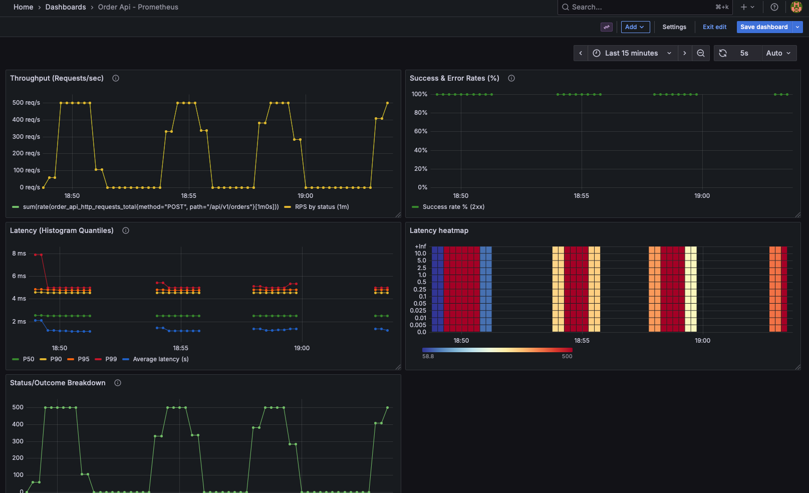
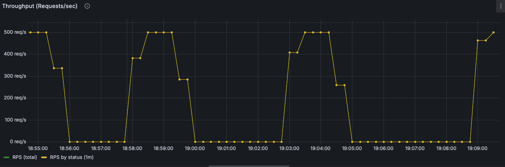
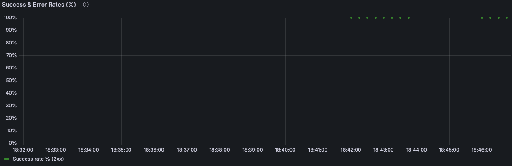
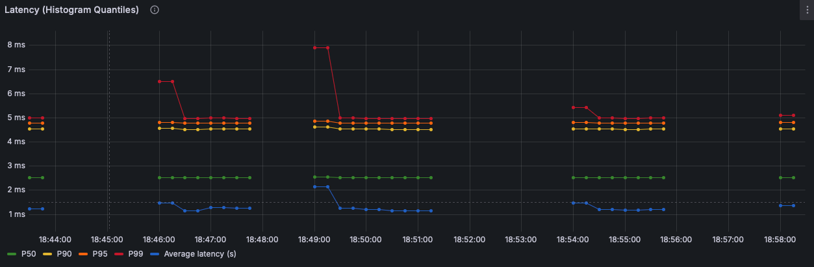
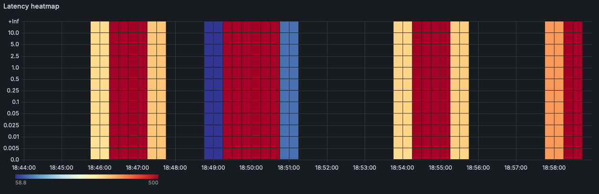
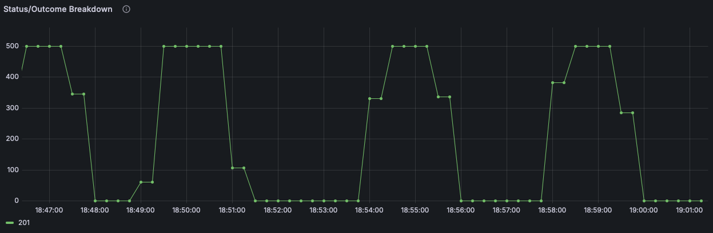

# Order API – Observability

Dashboard: Order API – Prometheus<br>
Service: `order-api` (POST /api/v1/orders)<br>
Purpose: Track request throughput, success/error rates, and latency distributions for the order intake path.

## Overview



## 1) Throughput (Requests/sec)
   
**Panel title:** Throughput (Requests/sec)<br>
What it shows: Total POST requests per second for `/api/v1/orders`, plus per-status split.<br>
Unit: `req/s` `(requests/second)`

### A. Total RPS
* Legend: RPS (total)
* Query:

```
sum(
    rate(order_api_http_requests_total
        {method="POST", path="/api/v1/orders"}[$__rate_interval])
        )
```

### B. RPS by Status
* Legend: `RPS {status}` (Grafana will show one series per status like RPS 200, RPS 500, etc.)
* Query:

```
sum by (status) (
  rate(order_api_http_requests_total{method="POST", path="/api/v1/orders"}[$__rate_interval])
)
```
Screenshot: 

## 2) Success & Error Rates (%)

**Panel title:** Success & Error Rates (%)<br>
What it shows: Percentage of 2xx, 4xx, 5xx responses over total.<br>
Unit: percent (0–100)<br>

### A. Success rate (2xx)
* Legend: Success rate (2xx) %
* Query:

```
100 *
sum(rate(order_api_http_requests_total{method="POST", path="/api/v1/orders", status=~"2.."}[1m]))
/
sum(rate(order_api_http_requests_total{method="POST", path="/api/v1/orders"}[1m]))
```

### B. 4xx error rate
* Legend: 4xx error rate %
* Query:

```
100 *
sum(rate(order_api_http_requests_total{method="POST", path="/api/v1/orders", status=~"4.."}[1m]))
/
sum(rate(order_api_http_requests_total{method="POST", path="/api/v1/orders"}[1m]))
```

### C. 4xx error rate
* Legend: 4xx error rate %
* Query:

```
100 *
sum(rate(order_api_http_requests_total{method="POST", path="/api/v1/orders", status=~"5.."}[1m]))
/
sum(rate(order_api_http_requests_total{method="POST", path="/api/v1/orders"}[1m]))
```

Screenshot: 


## 3) Latency (Histogram Quantiles)
**Panel title:** Latency (P50 / P90 / P95 / P99)<br>
What it shows: Request latency percentiles using histogram buckets.
Unit: seconds<br>
Base expression (used by all quantiles):

```
histogram_quantile(0.50,
  sum by (le) (
    rate(order_api_http_request_duration_seconds_bucket{method="POST", path="/api/v1/orders"}[1m])
  )
)
```

Screenshot: 


## 4) Latency Heatmap
**Panel title:** Latency Heatmap<br>
What it shows: Distribution of request durations over time.<br>
Unit: seconds (X-axis buckets → duration; color → samples per second)


```
sum by (le) (
  rate(order_api_http_request_duration_seconds_bucket{method="POST", path="/api/v1/orders"}[$__rate_interval])
)
```

Screenshot: 

## 5) Status / Outcome Breakdown
**Panel title:** Status / Outcome Breakdown<br>
What it shows: RPS by HTTP status code.<br>
Unit: `req/s`

```
sum by (le) (
  rate(order_api_http_request_duration_seconds_bucket{method="POST", path="/api/v1/orders"}[$__rate_interval])
)
```

Screenshot: 
