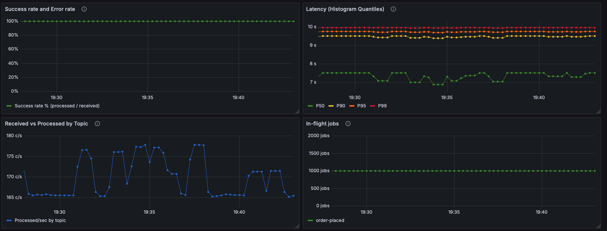
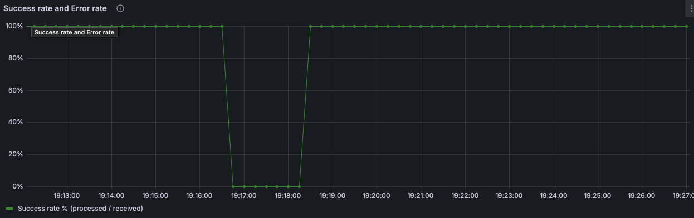
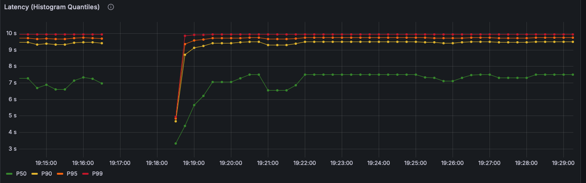
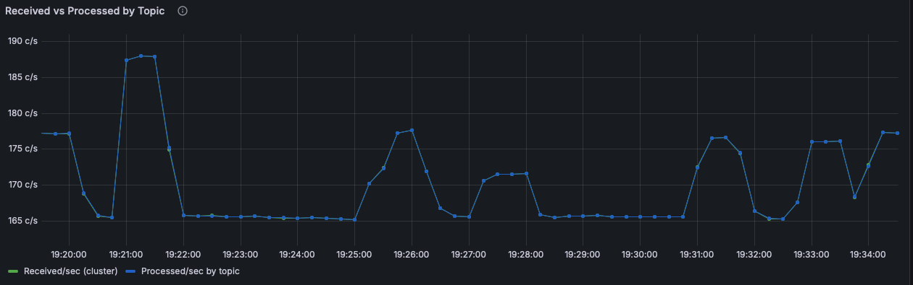
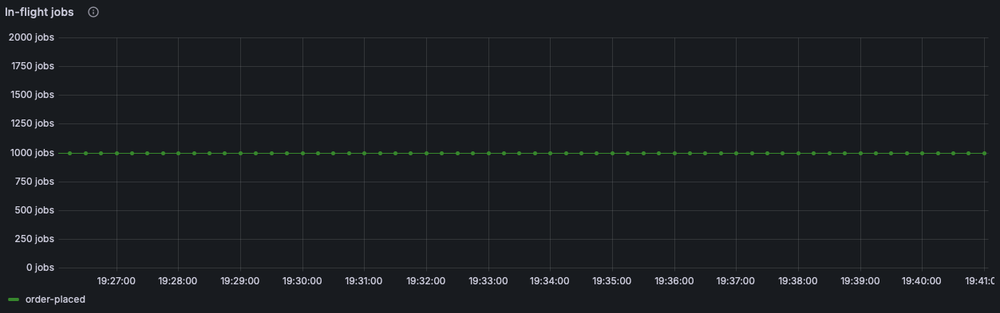

# Payment Worker – Observability
**Dashboard:** Payment Worker – Prometheus<br>
Service: payment-worker (Kafka consumer group) <br>
Purpose: Track job processing throughput, success/error rates, latency distributions, and in-flight job state for each topic (`orders-placed`, `orders-retry`, etc.).

## Overview



## 1) Success Rate & Error Rate (%)
**Panel title:** Success Rate & Error Rate (%)
What it shows: Percentage of successfully processed and failed messages relative to messages received.
Unit: percent (0–100)

### A. Success Rate
* Legend: Success rate % (processed / received)
* Query:

```
100 *
(
  sum(rate(pw_order_handler_processed_total[$__rate_interval]))
  /
  clamp_min(sum(rate(pw_order_handler_messages_received_total[$__rate_interval])), 1e-9)
)
```

### B. Error Rate
* Legend: Error rate % (failed / received)
* Query:

```
100 * 
(
  sum(rate(pw_order_handler_failed_total[$__rate_interval])) 
  / 
  clamp_min(sum(rate(pw_order_handler_messages_received_total[$__rate_interval])), 1e-9)
)
```

Screenshot: 

## 2) Latency (Histogram Quantiles)
**Panel title:** Processing Latency (Histogram Quantiles) <br>
What it shows: End-to-end processing time for a single payment job inside the worker.<br>
Unit: `seconds`

A. P50
* Legend: P50
* Query:
```
histogram_quantile(0.50, 
  sum(rate(pw_order_handler_process_duration_seconds_bucket[$__rate_interval])) by (le)
)
```
Screenshot: 

## 3) Received vs Processed by Topic

**Panel title:** Received vs Processed (per Topic) <br>
What it shows: Rate of messages received from Kafka vs. successfully processed jobs per topic. <br>
Unit: messages/sec

### A. Received/sec

* Legend: Received/sec (cluster)
* Query:

```
sum(rate(pw_order_handler_messages_received_total[$__rate_interval]))
```

### B. Processed/sec

* Legend: Processed/sec by topic
* Query:

```
sum(rate(pw_order_handler_processed_total[$__rate_interval]))
```

Screenshot: 

### 4) In-Flight Jobs
**Panel title:** In-Flight Jobs <br>
What it shows: Real-time number of jobs currently being processed (not yet acknowledged).<br>
Unit: count

* Legend: order-placed (or per-topic, depending on label exposure)
* Query:

```
pw_order_handler_inflight_jobs
```

Screenshot: 